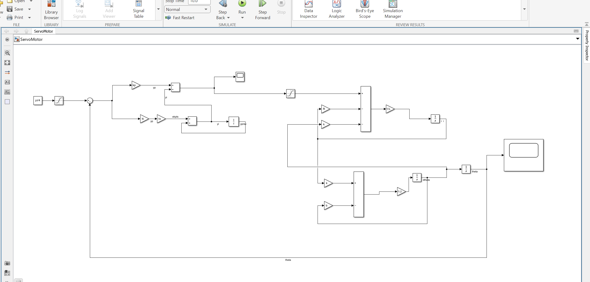
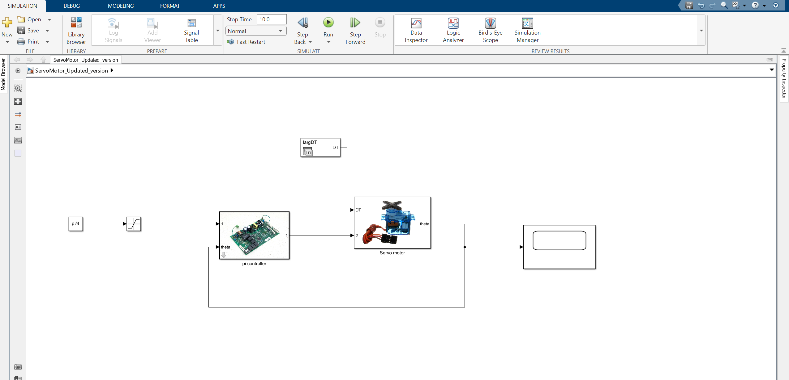
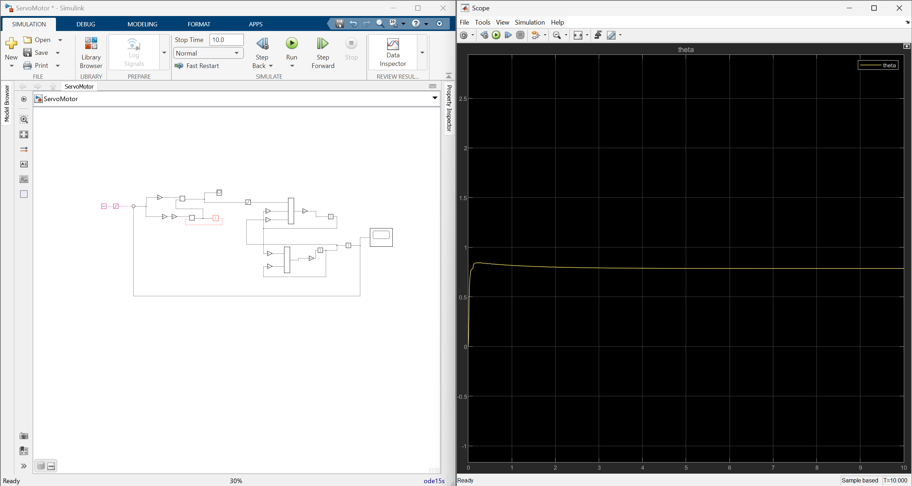
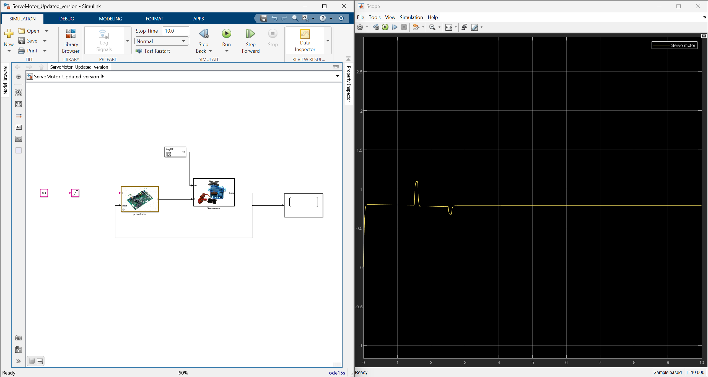

# 🚀 Servo Motor Control System – MATLAB Simulink  

This repository contains **MATLAB Simulink models** for a **Servo Motor Control System**, including:  
✅ **Basic Servo Motor Simulation** (ServoMotor.slx)  
✅ **Enhanced Version with Controller & Subsystems** (CreatingTestScenariosandComparingSimulations_2.slx)  
## 📌 Large vs. Small Disturbance Analysis  
This project analyzes how a **Servo Motor Control System** responds to **different disturbance magnitudes**.  

### 🔹 Key Findings:  
- **Small Disturbance** → System remains stable with minor deviations.  
- **Large Disturbance** → System experiences oscillations but recovers due to controller action.  

### 📊 Methods Used:  
✅ Simulink Modeling & Simulation  
✅ PID Controller Implementation  
✅ Disturbance Rejection Analysis  

## 📌 Features  
- **Forward & Inverse Kinematics Simulation**  
- **PID Controller Implementation**  
- **Subsystem Organization for Better Structure**  

## 🛠️ How to Run the Simulation  
1. **Download the `.slx` files**.  
2. Open **MATLAB** and go to the Simulink environment.  
3. Load the `.slx` file and click **Run**.  

## 📷 Screenshots – Large vs Small Disturbance Analysis  

### 🔹 Simulink Model (Original)  
  

### 🔹 Simulink Model (Updated Version)  
  

### 🔹 Simulation Run (Original Model)  
  

### 🔹 Simulation Run (Updated Version)  
  

### 🔹 Large vs Small Disturbance Comparison  

