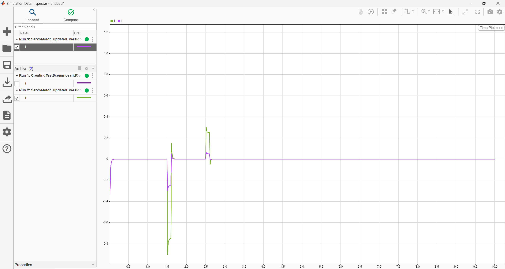

# 🚀 Servo Motor Control System – MATLAB Simulink  

This repository contains **MATLAB Simulink models** for analyzing and improving a **Servo Motor Control System**. The project includes **disturbance analysis, controller implementation, and structured subsystems**, making it a valuable resource for control system engineers and automation specialists.  

---

## 📌 Project Overview  
The goal of this project is to **simulate and analyze** the behavior of a **servo motor system** under different conditions. Two versions of the model are provided:  

✅ **Basic Servo Motor Simulation** (ServoMotor.slx)  
✅ **Enhanced Version with Controller & Subsystems** (CreatingTestScenariosandComparingSimulations_2.slx)  

Additionally, a **Large vs. Small Disturbance Analysis** was conducted to examine system response under varying input conditions.  

---

## 🚀 Features  
✔ **Servo Motor Modeling & Simulation** using MATLAB Simulink  
✔ **PID Controller Implementation** for better control performance  
✔ **Comparison of Large vs. Small Disturbances** on system stability  
✔ **Subsystem Organization** for a cleaner and structured model  
✔ **Real-world control system principles applied**  

---

## 🛠️ How to Run the Simulation  
1️⃣ **Download the `.slx` files** from this repository.  
2️⃣ Open **MATLAB** and go to the **Simulink** environment.  
3️⃣ Load the desired `.slx` file and click **Run** to simulate.  
4️⃣ Modify disturbance inputs and observe system response.  

---

## 📊 Large vs. Small Disturbance Analysis  
This project compares the servo motor's behavior under **different disturbance magnitudes** to evaluate control system robustness.  

### 🔹 Key Findings:  
- **Small Disturbance** → System remains stable with minor deviations.  
- **Large Disturbance** → System experiences oscillations but recovers due to controller action.  

### 📈 Disturbance Rejection Techniques:  
✅ PID Controller Tuning  
✅ System Response Monitoring  
✅ Performance Evaluation  

---

## 📷 Screenshots  

### 🔹 Simulink Model (Original)  
  

### 🔹 Simulink Model (Updated Version)  
  

### 🔹 Simulation Run (Original Model)  
  

### 🔹 Simulation Run (Updated Version)  
  

### 🔹 Large vs. Small Disturbance Comparison  
  

---

## 📂 File Structure  
```bash
📁 Servo_Motor_Simulation/
│── 📄 README.md   # Project documentation
│── 📄 ServoMotor.slx   # Original Simulink model
│── 📄 CreatingTestScenariosandComparingSimulations_2.slx   # Improved version
│── 🖼️ ServoMotor.png   # Screenshot of the original model
│── 🖼️ ServoMotorRun.png   # Simulation run (original)
│── 🖼️ ServoMotor_Updated_version.png   # Screenshot of the updated version
│── 🖼️ ServoMotor_Updated_versionRun.png   # Simulation run (updated)
│── 🖼️ Large_vs_Small_Disturbance_Analysis.png   # Disturbance analysis results
